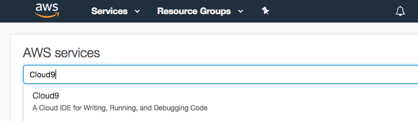

# Lab: Setting up an Application in the Cloud

**October 9, 2020**

## Foreword

This lab activity is readapted and significantly simplified from a 2-hours official workshop from Amzon AWS: "[Buidling a Modern Web Application](https://aws.amazon.com/getting-started/hands-on/build-modern-app-fargate-lambda-dynamodb-python/)" In the original workshop, many additional features are explored and tried out, such as machine-learning based approaches to track the interaction of customers, local testing of the application, or Continuous Integration / Continuous Deployment toolchains to support smarter and faster code production. If you are interested in exploring these additional features, you can also try out the original workshop.

In the spirit of "we don't code in this class", the number of changes or modifications to the source code required to carry out this lab activity have been reduced to the least possible. Anyhow, some minimal changes are actually required to support the actual deployment.

## Overview

In this lab, you’ll deploy a modern web-based application on [AWS](https://aws.amazon.com/). You will configure and deploy a sample website called *Mythical Mysfits* that enables visitors to adopt a fantasy creature (*mysfit*) as pet. You can see a working sample of this website at: [www.mythicalmysfits.com](https://www.mythicalmysfits.com/). The site provides basic functionality such as ability to “like” your favorite mysfit and reserve your chosen mysfit for adoption.

The code of the application is already developed (remember: we are not coding in this course!). We will use modern version control systems (in particular `git`) to get access to the code. Some files will be manually edited, related to the configuration of the cloud-based deployment. Take some time to try deploying this application on your own, after the lab!

To deploy this application, you need an [Amazon Web Services](https://aws.amazon.com/) account. You can create one for free, and for one year you are allowed to use some of their basic services for free (the *free-tier* usage). We will rely on many free-tier services in this lab, although note that some of the services could require a payment according to the pay-as-you-go model. Services have been selected so as to pick the cheapest one for educational purposes, so that deploying and running the overall lab should not cost more than $1/day.

## What You Will Learn

This tutorial will walk you through the steps to create a well-architected web application. You will learn to host this web application on a front-end web server and connect it to a backend database. You’ll also learn to set up user authentication. These are typical steps that are required for the largest part of modern web applications.

## Lab at a Glance

|                    |                                                              |
| ------------------ | ------------------------------------------------------------ |
| *Time to complete* | 2 hours                                                      |
| *Cost to complete* | Many of the Cloud services used are included in the [AWS Free Tier](https://aws.amazon.com/free/). For those that are not, the sample application will cost, in total, less than $1/day. This estimate assumes you follow the recommended configurations throughout the instructions and terminate all resources within 24 hours. At the end of these instructions, you will find links to the consoles where you can remove the resources. |
| *Prerequisites*    | To complete this lab, you will need an [AWS Account](https://aws.amazon.com/) and Administrator-level access to it. Please note that accounts that have been created within the last 24 hours might not yet have access to the resources required for this lab. |

## Overall System Architecture

The following application architecture diagram provides a structural representation of the services that make up Mythical Mysfits and how these services interact with each other. Some of these services are AWS-specific, so don't worry if you don't have a clue about what they are. They are commercial names for stuff that, to some extent, we have named during lectures, and we will come to that later. We'll also point to additional material to get more information about them.


## Part 1: Build a Static Website

Mythical Mysfits is a *dynamic* application, in the sense that it allows the user to interact with the website. To start with a simpler deployment, in this part, we will host the static content (html, js, css, media content, etc.) of our Mythical Mysfit website on [Amazon S3](https://aws.amazon.com/s3/) (Simple Storage Service). S3 is a highly durable, highly available, and inexpensive *object storage* service that can serve stored objects directly via HTTP. This makes it useful for serving static web content directly to web browsers for sites on the Internet.

Before we start storing our *mysfits* in S3, we should set up [AWS Cloud9](https://aws.amazon.com/cloud9/). Cloud9 is a cloud-based integrated development environment (IDE) that lets you write, run, and debug your code with just a browser. 

The system architecture for this part is extremely simple: we have a repository of content (our S3 *bucket*) which serves incoming requests from browsers.


### Step 1: Get Started

To begin, sign in to the [AWS Console](https://console.aws.amazon.com/) using your account. At this point, you can select an AWS Region, namely a geographical location where the application will be deployed. Note that, in general, Cloud providers try to offer the same services in all regions. Unfortunately, for some technical limitations not all services are actually available on all regions. This is mainly related to the fact that providers typically release their services in *cycles*, so older datacenters will likely offer more services, while newer ones will eventually see all of them.

This is the goal of the aforementioned System Architecture Diagrams: when you are *planning* a deployment in the cloud, you should already have a well-formed idea of the services that will be required. In this way, you can pick a region which offers all the services needed, also taking into account for the different costs of the services that typically vary geographically.

For this lab, we will use the `eu-west-1` (Ireland) region. You can select the region from the dropdown in the upper right corner of the AWS Management Console.

### Step 2: Create your Mythical Mysfits IDE

To create a new AWS Cloud9 Environmnet, on the AWS Console home page, **type Cloud9** into the service search bar and select it:



Click **Create Environment** on the Cloud9 home page:


Name your environment `MythicalMysfitsIDE` with any description you like, and click **Next Step**:


Leave the Environment settings as their defaults and click **Next Step**. Note that by default we are selecting a `t2.micro` EC2 instance, which is eligible for free tier.


Click **Create Environment**:


When the IDE has finished being created for you, you'll be presented with a welcome screen that looks like this:


If you have ever tried to write some code in any language, you can notice that the environment is well resembling that of a regular application used to write code. Yet, we are in the cloud!

We can now retrieve the source code of our application. As mentioned, we are using version control, in particular `git`, to collect the code.  Mythical Mysfits is developed in multiple languages (for educational purposes). Here, we will be using the `python` version. To retrieve the source code (i.e., to *clone* the repository), we use the command line. In the bottom panel, you will see a terminal command line open and ready to use. **Run the following git command** in the terminal to clone the necessary code:

```bash
git clone https://github.com/alessandropellegrini/mythicalmysfits.git
```

After cloning the repository, you'll see that your project explorer now includes the files cloned:


In the terminal, **change directory** to the newly cloned repository directory:

```bash
cd mythicalmysfits
```

### Step 3: Host the Website on S3

As mentioned, we are going to setup a static website in this part. To this end, we should *deploy* the source code of our application to S3. S3 works in *buckets*, which are structured key-value stores. Each bucket is given a name, which can be later used to retrieve its content via HTTP.

#### Create An S3 Bucket And Configure It For Website Hosting

We will create the infrastructure components needed for hosting a static website in Amazon S3 via the [AWS CLI](https://aws.amazon.com/cli/). While this might seem more complicated (and to some extent it is), this is the common way developers interact with cloud services. Large part of the work could be done via the web interface, but using the CLI is much more expressive, and sometimes gives you access to capabilities that are hard or not available in the graphical user interface. The good thing of Cloud9 is that the tool is already configured for you.

First, we shall **create an S3 bucket** and **pick some unique bucket name**. You should replace `REPLACE_ME_BUCKET_NAME` with a name of your choice. Please see the [requirements for bucket names](https://docs.aws.amazon.com/AmazonS3/latest/dev/BucketRestrictions.html#bucketnamingrules), to pick a consistent one. **Note down the name you choose for later**, as you will use it in several other places during this lab:

```bash
aws s3 mb s3://REPLACE_ME_BUCKET_NAME
```

Now that we have created a bucket, we need to **set some configuration options** that enable the bucket to be used for [static website hosting](https://docs.aws.amazon.com/AmazonS3/latest/dev/WebsiteHosting.html). This configuration enables the objects in the bucket to be requested using a registered public DNS name for the bucket, as well as direct site requests to the base path of the DNS name to a selected website homepage (`index.html` in most cases):

```bash
aws s3 website s3://REPLACE_ME_BUCKET_NAME --index-document index.html
```

#### Update The S3 Bucket Policy

All buckets created in Amazon S3 are fully *private* by default. In order to be used as a public website, we need to create an S3 [Bucket Policy](https://docs.aws.amazon.com/AmazonS3/latest/dev/example-bucket-policies.html) that indicates objects stored within this new bucket may be publicly accessed by anyone. Bucket policies are represented as JSON documents that define the S3 Actions (S3 API calls) that are allowed (or not not allowed) to be performed by different [Principals](https://docs.aws.amazon.com/AmazonS3/latest/dev/s3-bucket-user-policy-specifying-principal-intro.html) (in our case the public, or anyone).

The JSON document for the necessary bucket policy is located at: `~/environment/aws-modern-application-workshop/module-1/aws-cli/website-bucket-policy.json`. This file contains a string that needs to be replaced with the bucket name you've chosen (indicated with `REPLACE_ME_BUCKET_NAME`).

***Note***: Throughout this lab you will be similarly opening files that have contents which need to be replaced (all will be prefixed with `REPLACE_ME_`, to make them easy to find using CTRL-F on Windows or ⌘-F on Mac.) 

To **open a file** in Cloud9, use the File Explorer on the left panel and double click `website-bucket-policy.json`:


This will open the file in the File Editor panel. Replace the string shown with your chosen bucket name used in the previous commands:


**Execute the following CLI command** to add a public bucket policy to your website:

```bash
aws s3api put-bucket-policy --bucket REPLACE_ME_BUCKET_NAME --policy file://~/environment/mythicalmysfits/part-1/aws-cli/website-bucket-policy.json
```

#### Publish The Website Content To S3

Now that our new website bucket is configured appropriately, let's add the first iteration of the Mythical Mysfits homepage to the bucket. Use the following S3 CLI command that mimics the linux command for copying files (`cp`) to **copy the provided `index.html` page locally from your IDE up to the new S3 bucket** (replacing the bucket name appropriately).

```bash
aws s3 cp ~/environment/mythicalmysfits/part-1/web/index.html s3://REPLACE_ME_BUCKET_NAME/index.html 
```

Now, **open up your favorite web browser** and enter one the URI below into the address bar. Remember to replace the bucket name accordingly. You should see your static website appearing.

```bash
http://REPLACE_ME_BUCKET_NAME.s3-website-eu-west-1.amazonaws.com
```


## Part 2: Store Mysfit Information

Let's now add another foundational piece of functionality to the Mythical Mysfits website architecture: a data tier. We will create a table in [Amazon DynamoDB](https://aws.amazon.com/dynamodb/), a managed and scalable [NoSQL](https://aws.amazon.com/nosql/) database service on AWS with super fast performance. We will store all of the Mysfits in a database to make the website more extensible and scalable.


### Adding A NoSQL Database To Mythical Mysfits

To add a DynamoDB table to the architecture, we have included another JSON CLI input file that defines a table called MysfitsTable. This table will have a primary index defined by a hash key attribute called MysfitId, and two more secondary indexes. The first secondary index will have the hash key of Species and a range key of MysfitId, and the second secondary index will have the hash key of Alignment and a range key of MysfitId.

These two secondary indexes will allow us to execute queries against the table to retrieve all of the mysfits that match a given Species or Alignment to enable the filter functionality you may have noticed isn't yet working on the website. You can view this file at `~/environment/mythicalmysfits/part-2/aws-cli/dynamodb-table.json`. No changes need to be made to this file and it is ready to execute. To learn more about indexes in DynamoDB and other core concepts, visit [this page.](https://docs.aws.amazon.com/amazondynamodb/latest/developerguide/HowItWorks.CoreComponents.html) 

**To create the table using the AWS CLI, execute the following command in the Cloud9 terminal:**

```bash
aws dynamodb create-table --cli-input-json file://~/environment/mythicalmysfits/part-2/aws-cli/dynamodb-table.json
```

After the command runs, you can **view the details of your newly created table** by executing the following AWS CLI command in the terminal:

```bash
aws dynamodb describe-table --table-name MysfitsTable
```

If we execute the following command to retrieve all of the items stored in the table, you'll see that the table is empty:

```bash
aws dynamodb scan --table-name MysfitsTable
{
    "Count": 0,
    "Items": [],
    "ScannedCount": 0,
    "ConsumedCapacity": null
}
```

Also provided is a JSON file that can be used to batch insert a number of Mysfit items into this table. This will be accomplished through the DynamoDB API BatchWriteItem.

To call this API using the provided JSON file, **execute the following terminal command** (the response from the service should report that there are no items that went unprocessed):

```bash
aws dynamodb batch-write-item --request-items file://~/environment/mythicalmysfits/part-2/aws-cli/populate-dynamodb.json
```

Now, **if you run the same command** to scan all of the table contents, you'll find the items have been loaded into the table:

```bash
aws dynamodb scan --table-name MysfitsTable
```


## Part 3: Build a Dynamic Website

We will rely on a *microservice* hosted using AWS Fargate so that your Mythical Mysfits website can integrate with an *application backend*. [AWS Fargate](https://aws.amazon.com/fargate/) is a deployment option in [Amazon Elastic Container Service](https://aws.amazon.com/ecs/) (ECS) that allows you to deploy containers without having to manage any clusters or servers. For our Mythical Mysfits backend, we will use Python and create a Flask app in a Docker container behind a Network Load Balancer. These will form the microservice backend for the frontend website.

Fargate is a good choice to build long-running processes such as microservices backends for web, mobile, and PaaS platforms. Fargate allows to get the control of containers, without worrying about provisioning or scaling servers.  Another option for compute needs is [AWS Lambda](https://aws.amazon.com/lambda/). While Lambda offers the same *serverless* benefits as Fargate, Lambda is great for data-driven applications that need to respond in real-time to changes in data, shifts in system state, or actions by users.

This part of the lab is the longest, so it has been divided into three sub-parts for easiness of reading.

### Part 2A: Setup Core Infrastructure

Before we can create our service, we need to create the core infrastructure environment that the service will use, including the networking infrastructure in [Amazon VPC](https://aws.amazon.com/vpc/), and the [AWS Identity and Access Management Roles](https://aws.amazon.com/iam/) that will define the permissions that ECS and our containers will have on top of AWS.

We will use [AWS CloudFormation](https://aws.amazon.com/cloudformation/) to accomplish this. AWS CloudFormation is a service that can programmatically provision AWS resources that you declare within JSON or YAML files called CloudFormation Templates, enabling the common best practice of infrastructure as code.  

There is a CloudFormation template to create all of the necessary Network and Security resources in `mythicalmysfits/part-3/cfn/core.yml`. This template will create the following resources:

- **[An Amazon VPC](https://aws.amazon.com/vpc/)**: a network environment that contains four subnets (two public and two private) in the `10.0.0.0/16` private IP space, as well as all the needed Route Table configurations. The subnets for this network are created in separate AWS Availability Zones (AZ) to enable high availability across multiple physical facilities in an AWS Region. You can read the following documentation to learn more about how AZs can help you achieve [high availability](https://docs.aws.amazon.com/AmazonRDS/latest/UserGuide/Concepts.RegionsAndAvailabilityZones.html).

- **[Two NAT Gateways](https://docs.aws.amazon.com/vpc/latest/userguide/vpc-nat-gateway.html)** (one for each public subnet): allows the containers we will eventually deploy into our private subnets to communicate out to the Internet to download necessary packages, etc.

- **[A DynamoDB VPC Endpoint](https://docs.aws.amazon.com/amazondynamodb/latest/developerguide/vpc-endpoints-dynamodb.html)**: our microservice backend will eventually integrate with [Amazon DynamoDB](https://aws.amazon.com/dynamodb/) for data persistence.

- **[A Security Group](https://docs.aws.amazon.com/vpc/latest/userguide/VPC_SecurityGroups.html)**: Allows your Docker containers to receive traffic on port `8080` from the Internet through the Network Load Balancer.

- **[IAM Roles](https://docs.aws.amazon.com/IAM/latest/UserGuide/id_roles.html)**: Identity and Access Management Roles are created. These will be used throughout the lab to give AWS services or resources access to other AWS services like DynamoDB, S3, and more.

To create these resources, **run the following command in the Cloud9 terminal** (will take ~10 minutes for stack to be created):

  ```bash
aws cloudformation create-stack --stack-name MythicalMysfitsCoreStack --capabilities CAPABILITY_NAMED_IAM --template-body file://~/environment/mythicalmysfits/part-3/cfn/core.yml
  ```

You can check on the status of your stack creation either via the AWS Console or by **running the command:**

  ```bash
aws cloudformation describe-stacks --stack-name MythicalMysfitsCoreStack
  ```

Run repeatedly this command, until you see a status of `"StackStatus": "CREATE_COMPLETE"`.


When you get this response, CloudFormation has finished provisioning all of the core networking and security resources described above and you can proceed. Wait for the above stack to show `CREATE_COMPLETE` before proceeding on.

**You will be using values from the output of this command throughout the rest of the lab.** You can run the following command to directly output the above describe-stacks command to a new file in your IDE that will be stored as `cloudformation-core-output.json`:

  ```bash
aws cloudformation describe-stacks --stack-name MythicalMysfitsCoreStack > ~/environment/cloudformation-core-output.json
  ```

### Part 2B: Deploy A Service With AWS Fargate

You should now create a Docker container image that contains all of the code and configuration required to run the Mythical Mysfits backend as a microservice API created with Flask. We will build the Docker container image within Cloud9 and then push it to the Amazon Elastic Container Registry, where it will be available to pull when we create our service using Fargate. Below, you can find a picture of the System Architecture that we are going to set up.


#### Step 1: Create a Flask Service

All of the code required to run our service backend is stored within the `/part-3/app/` directory of the repository you cloned into your Cloud9 IDE. If you would like to review the Python code that uses Flask to create the service API, view the `/part-3/app/service/mythicalMysfitsService.py` file.

Docker comes already installed on the Cloud9 IDE that you created, so in order to build the Docker image locally, all we need to do is run the following two commands in the Cloud9 terminal:  

First **change directory** to `~/environment/mythicalmysfits/part-3/app`

```bash
cd ~/environment/mythicalmysfits/part-3/app
```

You should now retrieve from the previous CloudFormation describe-stacks command, stored in `cloudformation-core-output.json`,  your account ID. Replace `REPLACE_ME_ACCOUNT_ID` with your account ID in the following command to build the docker image using the file `Dockerfile`, which contains Docker instructions. The command tags the Docker image, using the `-t` option, with a specific tag format so that the image can later be pushed to the Amazon Elastic Container Registry service.

```bash
docker build . -t REPLACE_ME_AWS_ACCOUNT_ID.dkr.ecr.eu-west-1.amazonaws.com/mythicalmysfits/service:latest
```

You will see docker download and install all of the necessary dependency packages that our application needs, and output the tag for the built image. **Copy the image tag for later reference**. Below an example tag shown as: `111111111111.dkr.ecr.eu-west-1.amazonaws.com/mythicalmysfits/service:latest`.

```bash
Successfully built 8bxxxxxxxxab
Successfully tagged 111111111111.dkr.ecr.eu-west-1.amazonaws.com/mythicalmysfits/service:latest
```

We are now ready to create a container image repository in [Amazon Elastic Container Registry](https://aws.amazon.com/ecr/) (Amazon ECR) and push our image into it. In order to create the registry, run the following command, this **creates a new repository in the default AWS ECR registry** created for your account.

```bash
aws ecr create-repository --repository-name mythicalmysfits/service
```

The response to this command will contain additional metadata about the created repository. In order to push container images into our new repository, we will need to obtain authentication credentials for our Docker client to the repository.

**Run the following command**, which will return a login command to retrieve credentials for our Docker client and then automatically execute it (include the full command including the `$` below). '**Login Succeeded**' will be reported if the command is successful.

```bash
$(aws ecr get-login --no-include-email)
```

Next, **push the image you created to the ECR repository** using the copied tag from above. Using this command, Docker will push your image and all the images it depends on to Amazon ECR:

```bash
docker push REPLACE_ME_WITH_DOCKER_IMAGE_TAG
```

**Run the following command** to see your newly pushed Docker image stored inside the ECR repository:

```bash
aws ecr describe-images --repository-name mythicalmysfits/service
```

#### Step 2: Configure The Service Prerequisites In Amazon ECS

Now, we have an image available in ECR that we can deploy to a service hosted on Amazon ECS using AWS Fargate. The service generated before will now be deployed in the cloud and publicly available behind a Network Load Balancer.

First, we will create a cluster in the **Amazon Elastic Container Service (ECS)**. This represents the cluster of “servers” that your service containers will be deployed to. Servers is in "quotations" because you will be using **AWS Fargate**. Fargate allows you to specify that your containers be deployed to a cluster without having to actually provision or manage any servers yourself.

To create a new cluster in ECS, **run the following command**:

```bash
aws ecs create-cluster --cluster-name MythicalMysfits-Cluster
```

Next, we will create a new log group in **AWS CloudWatch Logs**. AWS CloudWatch Logs is a service for log collection and analysis. The logs that your container generates will automatically be pushed to AWS CloudWatch logs as part of this specific group. This is especially important when using AWS Fargate since you will not have access to the server infrastructure where your containers are running.

To create the new log group in CloudWatch logs, **run the following command**:

```bash
aws logs create-log-group --log-group-name mythicalmysfits-logs
```

Now that we have a cluster created and a log group defined for where our container logs will be pushed to, we're ready to register an ECS **task definition**. A task in ECS is a set of container images that should be scheduled together. A task definition declares that set of containers and the resources and configuration those containers require. You will use the AWS CLI to create a new task definition for how your new container image should be scheduled to the ECS cluster we just created.

A JSON file has been provided that will serve as the input to the CLI command. **Open `~/environment/mythicalmysfits/part-3/aws-cli/task-definition.json `in the IDE.**

**Replace the indicated values** with the appropriate ones from your created resources. These values will be pulled from the CloudFormation response you copied earlier as well as the docker image tag that you pushed earlier to ECR, eg: `REPLACE_ME_ACCOUNT_ID.dkr.ecr.eu-west-1.amazonaws.com/mythicalmysfits/service:latest`

Once you have replaced the values in `task-defintion.json` and saved it, execute the following command to register a new task definition in ECS:

```bash
aws ecs register-task-definition --cli-input-json file://~/environment/mythicalmysfits/part-3/aws-cli/task-definition.json
```

#### Step 3: Enable A Load Balanced Fargate Service

With a new task definition registered, we're ready to provision the infrastructure needed in our service stack. Rather than directly expose our service to the Internet, we will provision a **Network Load Balancer (NLB)** to sit in front of our service tier. This would enable our frontend website code to communicate with a single DNS name while our backend service would be free to elastically scale in and out, based on demand or if failures occur and new containers need to be provisioned.

To provision a new NLB, **execute the following CLI command** in the Cloud9 terminal (retrieve the subnetIds from the CloudFormation output you saved):

```bash
aws elbv2 create-load-balancer --name mysfits-nlb --scheme internet-facing --type network --subnets REPLACE_ME_PUBLIC_SUBNET_ONE REPLACE_ME_PUBLIC_SUBNET_TWO > ~/environment/nlb-output.json
```

When this command has successfully completed, a new file will be created in your IDE called `nlb-output.json`. You will be using the `DNSName`, `VpcId`, and `LoadBalancerArn` in later steps.

Next, use the CLI to create an **NLB target group**. A target group allows AWS resources to register themselves as targets for requests that the load balancer receives to forward. Our service containers will automatically register to this target so that they can receive traffic from the NLB when they are provisioned. This command includes one value that will need to be replaced, your `vpc-id` which can be found as a value within the earlier saved MythicalMysfitsCoreStack output returned by CloudFormation (stored in `cloudformation-core-output.json`).

```bash
aws elbv2 create-target-group --name MythicalMysfits-TargetGroup --port 8080 --protocol TCP --target-type ip --vpc-id REPLACE_ME_VPC_ID --health-check-interval-seconds 10 --health-check-path / --health-check-protocol HTTP --healthy-threshold-count 3 --unhealthy-threshold-count 3 > ~/environment/target-group-output.json
```

When this command completes, its output will be saved to `target-group-output.json` in your IDE. You will reference the `TargetGroupArn` value in a subsequent step.

Next, **use the CLI to create a load balancer listener for the NLB**. This informs that load balancer that for requests received on a specific port, they should be forwarded to targets that have registered to the above target group. Be sure to replace the two indicated values with the appropriate ARN from the TargetGroup and the NLB that you saved from the previous steps:

```bash
aws elbv2 create-listener --default-actions TargetGroupArn=REPLACE_ME_NLB_TARGET_GROUP_ARN,Type=forward --load-balancer-arn REPLACE_ME_NLB_ARN --port 80 --protocol TCP
```

#### Step 4: Create A Service With Fargate

We now need to create a **service linked role** in IAM that grants the ECS service itself permissions to make ECS API requests within your account. This is required because when you create a service in ECS, the service will call APIs within your account to perform actions like pulling Docker images, creating new tasks, etc. Without creating this role, the ECS service would not be granted permissions to perform the actions required. To create the role, execute the following command in the terminal:  

```bash
aws iam create-service-linked-role --aws-service-name ecs.amazonaws.com
```

If the above returns an error about the role existing already, you can ignore it, as it would indicate the role has automatically been created in your account in the past.

With the NLB created and configured, and the ECS service granted appropriate permissions, we're ready to create the actual ECS **service** where our containers will run and register themselves to the load balancer to receive traffic. We have included a JSON file for the CLI input that is located at: `~/environment/aws-modern-application-workshop/module-2/aws-cli/service-definition.json`. This file includes all of the configuration details for the service to be created, including indicating that this service should be launched with **AWS Fargate**—which means that you do not have to provision any servers within the targeted cluster. The containers that are scheduled as part of the task used in this service will run on top of a cluster that is fully managed by AWS.

**Open `~/environment/mythicalmysfits/part-3/aws-cli/service-definition.json` in the IDE and replace the indicated values of `REPLACE_ME_`. Save it, then run the following command to create the service:**

```bash
aws ecs create-service --cli-input-json file://~/environment/mythicalmysfits/part-3/aws-cli/service-definition.json
```

Copy the DNS name you saved when creating the NLB and send a request to it using the preview browser in Cloud9 (or by simply any web browser, since this time our service is available on the Internet). Try sending a request to the mysfits resource (the DNSName in `nlb-output.json`), something like:

```bash
http://mysfits-nlb-123456789-abc123456.elb.eu-west-1.amazonaws.com/mysfits
```

A response showing a JSON file showing Mysfits data in Cloud9 means your Flask API is up and running on AWS Fargate.

*Note*: This Network Load Balancer only supports HTTP (`http://`) requests since no SSL/TLS certificates are installed on it. For this lab, be sure to submit requests using `http://` only, `https://` requests will not work properly.

#### Step 5: Update Mythical Mysfits To Call The NLB

Next, we need to integrate our website with your new API backend instead of using the hard coded data that we previously uploaded to S3. You'll need to update the following file to use the same NLB URL for API calls (do not include the `/mysfits` path): `mythicalmysfits/part-3/web/index.html`

**Open the file in Cloud9 and replace the highlighted area below between the quotes with the NLB URL:**


To upload this file to your S3 hosted website, **use the bucket name again that was created** during Part 1, and **run the following command**:

```bash
aws s3 cp ~/environment/mythicalmysfits/part-3/web/index.html s3://INSERT-YOUR-BUCKET-NAME/index.html
```

**Open your website using the same URL used at the end of Part 1** in order to see your new Mythical Mysfits website, which is retrieving JSON data from your Flask API running within a Docker container deployed to AWS Fargate!

## Part 4: Setup User Registration

In order to add some more critical aspects to the Mythical Mysfits website, like allowing users to vote for their favorite mysfit and adopt a mysfit, we need to first have users register on the website. To enable registration and authentication of website users, we will create a [User Pool](https://docs.aws.amazon.com/cognito/latest/developerguide/cognito-user-identity-pools.html) in [AWS Cognito](https://aws.amazon.com/cognito/), a fully managed user identity management service.

Then, to make sure that only registered users are authorized to like or adopt mysfits on the website, we will deploy a REST API with [Amazon API Gateway](https://aws.amazon.com/api-gateway/) to sit in front of our NLB. Amazon API Gateway is also a managed service, and provides commonly required REST API capabilities out of the box like SSL termination, request authorization, throttling, API stages and versioning, and much more.


### Step 1: Add A User Pool For Website Users

To create the Cognito User Pool where all of the Mythical Mysfits visitors will be stored, **execute the following CLI command** to create a user pool named MysfitsUserPool and indicate that all users who are registered with this pool should automatically have their email address verified via confirmation email before they become confirmed users.

```bash
aws cognito-idp create-user-pool --pool-name MysfitsUserPool --auto-verified-attributes email
```

**Copy the response** from the above command, which includes the unique ID for your user pool that you will need to use in later steps. Eg: Id: `eu-west-1_ab12345YZ`)

Next, in order to integrate our frontend website with Cognito, we must create a new **User Pool Client** for this user pool. This generates a unique client identifier that will allow our website to be authorized to call the unauthenticated APIs in cognito where website users can sign-in and register against the Mythical Mysfits user pool. To create a new client using the AWS CLI for the above user pool, **run the following command** (replacing the --user-pool-id value with the one you copied above):

```bash
aws cognito-idp create-user-pool-client --user-pool-id REPLACE_ME --client-name MysfitsUserPoolClient
```

**Copy the output of this command**, because we will need the user pool client id later.

### Step 2: Add A New REST API With Amazon API Gateway

Next, let's turn our attention to creating a new RESTful API in front of our existing Flask service, so that we can perform request authorization before our NLB receives any requests. We will do this with Amazon API Gateway, as described in the module overview.

In order for API Gateway to privately integrate with our NLB, we will configure an **API Gateway VPC Link** that enables API Gateway APIs to directly integrate with backend web services that are privately hosted inside a VPC. Note: For the purposes of this lab, we created the NLB to be internet-facing so that it could be called directly in earlier modules. Because of this, even though we will be requiring Authorization tokens in our API after this module, our NLB will still actually be open to the public behind the API Gateway API.

In a real-world scenario, you should create your NLB to be internal from the beginning (or create a new internal load balancer to replace the existing one), knowing that API Gateway would be your strategy for Internet-facing API authorization. But for the sake of time, we'll use the NLB that we've already created that will stay publicly accessible.

**Create the VPC Link for our upcoming REST API** using the following CLI command (you will need to replace the indicated value with the Load Balancer ARN you saved when the NLB was created in module 2):

```bash
aws apigateway create-vpc-link --name MysfitsApiVpcLink --target-arns REPLACE_ME_NLB_ARN > ~/environment/api-gateway-link-output.json
```

The above command will create a file called `api-gateway-link-output.json` that contains the id for the VPC Link that is being created. It will also show the status as PENDING, similar to below.

It will take about 5-10 minutes to finish being created, you can **copy the id from this file** and proceed on to the next step.

```bash
{
    "status": "PENDING",
    "targetArns": [
        "YOUR_ARN_HERE"
    ],
    "id": "abcdef1",
    "name": "MysfitsApiVpcLink"
}
```

With the VPC link creating, we can move on to create the actual REST API using Amazon API Gateway.

Your MythicalMysfits REST API is defined using **Swagger**, a popular open-source framework for describing APIs via JSON. This Swagger definition of the API is located at `~/environment/mythicalmysfits/part-4/aws-cli/api-swagger.json`. Open this file and you'll see the REST API and all of its resources, methods, and configuration defined within.

There are several places within this JSON file that need to be updated to include parameters specific to your Cognito User Pool, as well as your Network Load Balancer.

The `securityDefinitions` object within the API definition indicates that we have setup an apiKey authorization mechanism using the Authorization header. You will notice that AWS has provided custom extensions to Swagger using the prefix `x-amazon-api-gateway-`, these extensions are where API Gateway specific functionality can be added to typical swagger files to take advantage of API Gateway-specific capabilities.

**CTRL-F through the file** to search for the various places `REPLACE_ME` is located and awaiting your specific parameters. Once the edits have been made, save the file and execute the following AWS CLI command:  

```bash
aws apigateway import-rest-api --parameters endpointConfigurationTypes=REGIONAL --body file://~/environment/mythicalmysfits/part-4/aws-cli/api-swagger.json --fail-on-warnings
```

**Copy the response** this command returns and save the `id` value for the next step:

```bash
{
    "name": "MysfitsApi",
    "endpointConfiguration": {
        "types": [
            "REGIONAL"
        ]
    },
    "id": "abcde12345",
    "createdDate": 1529613528
}
```

Now, our API has been created, but it's yet to be deployed anywhere. To deploy our API, we must first create a deployment and indicate which **stage** the deployment is for. A stage is a named reference to a deployment, which is a snapshot of the API.

You use a Stage to manage and optimize a particular deployment. For example, you can set up stage settings to enable caching, customize request throttling, configure logging, define stage variables or attach a canary release for testing. We will call our stage `prod`. To create a deployment for the prod stage, execute the following CLI command:

```bash
aws apigateway create-deployment --rest-api-id REPLACE_ME_WITH_API_ID --stage-name prod
```

With that, our REST API that's capable of user Authorization is deployed and available on the Internet... but where?! **Your API is available at the following location:**

```markup
https://REPLACE_ME_WITH_API_ID.execute-api.REPLACE_ME_WITH_REGION.amazonaws.com/prod
```

**Copy the above, replacing the appropriate values, and add `/mysfits` to the end of the URI.** Entered into a browser address bar, you should once again see your Mysfits JSON response. But, we've added several capabilities like adopting and liking mysfits that our Flask service backend doesn't have implemented yet.

**Let's take care of that next.**

While those service updates are being automatically pushed through your CI/CD pipeline, **continue on to the next step.**

### Step 3: Update the Mythical Mysfits Website

Open the new version of the Mythical Mysfits `index.html` file we will push to [Amazon S3](https://aws.amazon.com/s3/) shortly, it is located at: `~/environment/mythicalmysfits/part-4/app/web/index.html`. In this new `index.html` file, you'll notice additional HTML and JavaScript code that is being used to add a user registration and login experience.

This code is interacting with the AWS Cognito JavaScript SDK to help manage registration, authentication, and authorization to all of the API calls that require it.

In this file, **replace the strings REPLACE_ME** inside the single quotes with the OutputValues you copied from above and save the file:


Also, for the user registration process, you have an additional two HTML files to insert these values into. They are `register.html` and `confirm.html`. Insert the copied values into the **REPLACE_ME** strings in these files as well.

Now, **lets copy these HTML files, as well as the Cognito JavaScript SDK to the S3 bucket** hosting our Mythical Mysfits website content so that the new features will be published online.

```bash
aws s3 cp --recursive ~/environment/mythicalmysfits/part-4/web/ s3://YOUR-S3-BUCKET/
```

**Refresh the Mythical Mysfits website** in your browser to see the new functionality in action!

## Cleanup

Be sure to **delete all the resources** created during the lab in order to ensure that billing for the resources does not continue for longer than you intend. We recommend that you utilize the AWS Console to **explore the resources** you've created and **delete them when you're ready**.

For the two cases where you provisioned resources using AWS CloudFormation, you can remove those resources by simply **running the following CLI command** for each stack:

```bash
aws cloudformation delete-stack --stack-name STACK-NAME-HERE
```

To remove all of the created resources, you can also visit the following AWS Consoles, which contain resources you've created during the Mythical Mysfits workshop:

* [Amazon S3](https://s3.console.aws.amazon.com/)
* [Amazon API Gateway](https://console.aws.amazon.com/apigateway)
* [Amazon Cognito](https://console.aws.amazon.com/cognito)
* [Amazon DynamoDB](https://console.aws.amazon.com/dynamodb)
* [Amazon ECS](https://console.aws.amazon.com/ecs/)
* [Amazon EC2](https://console.aws.amazon.com/ec2)
* [Amazon VPC](https://console.aws.amazon.com/vpc)
* [AWS IAM](https://console.aws.amazon.com/iam)
* [AWS CloudFormation](https://console.aws.amazon.com/cloudformation)